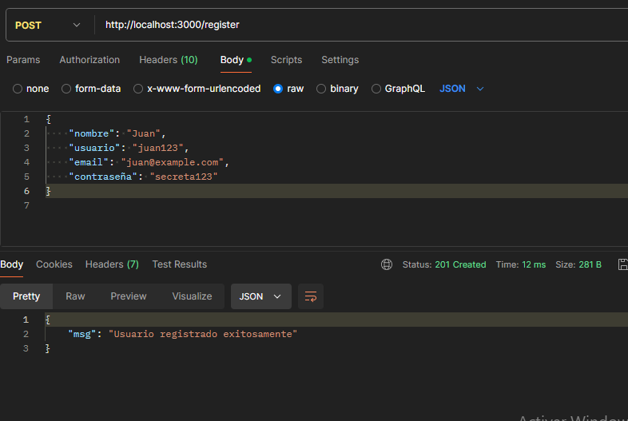
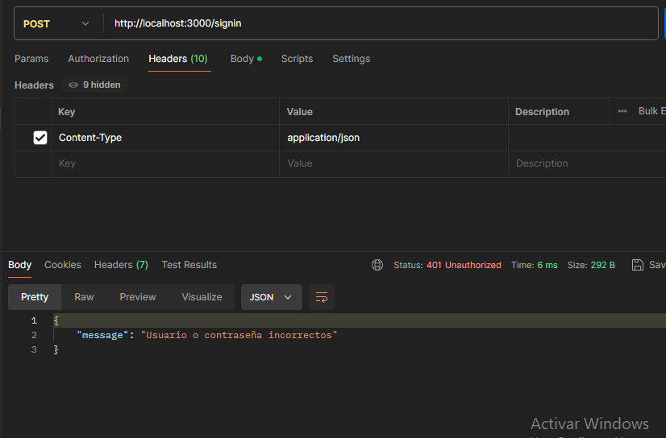

#Clonar el repositorio:

git clone https://github.com/tu-usuario/nombre-del-repo.git

cd nombre-del-repo

#Instalar dependencias:

npm install

npm init -y

npm install express-validator

npm run dev

#tweets

#user

